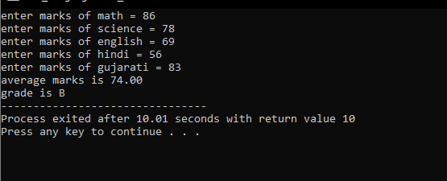
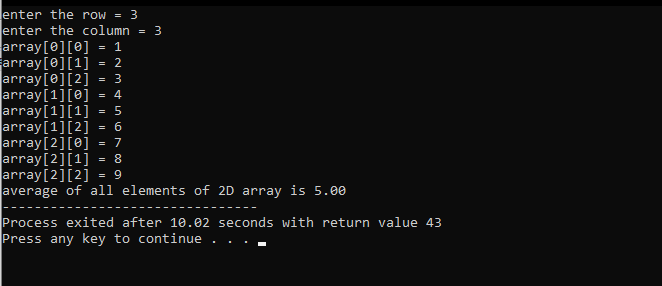
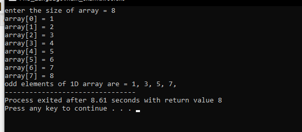
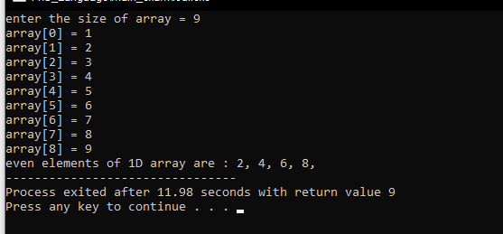
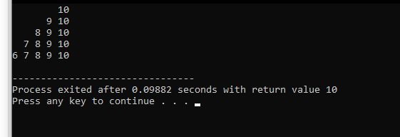

<h1>C Language Exam</h1>

Q1 Implement a C program to find an average and a grade of a student. Consider 5 subjects. Assign out of 100 marks for each subject. Use conditions for evaluate grades based on average value.

Q2 Write a C program to find the average of all elements in a 2D array using a function.

Q3 Write a C program that defines a function to print only odd elements from 1D array elements.

Q4 Write a C program to find even elements from an 1D array using Pointer.

Q5 Print a below pattern using nested for loop in C language.

